# digital-ocean-k8s-challenge

**Problem Statement**: *Deploy a scalable SQL database cluster*  
"When deploying a database on Kubernetes, you have to make it redundant and scalable. You can rely on database management operators like KubeDB or database-specific solutions like Kubegres for PostgreSQL or the MySQL Operator for MySQL." 

**My Solution**: I used the [Kubegres](https://www.kubegres.io) operator to deploy a 3 node PostgreSQL database cluster on a managed Digital Ocean Kubernetes cluster.

**Prerequisites**:
- [Digital Ocean Account](https://www.digitalocean.com/)
- [psql](https://www.postgresql.org/download/)
- [kubectl](https://kubernetes.io/docs/tasks/tools/)
- [doctl](https://docs.digitalocean.com/reference/doctl/how-to/install/)

## Step 1: Create a Digital Ocean Kubernetes Cluster via doctl

- There are multiple way in which you could perform this step. Here's a link to the official documentation: https://docs.digitalocean.com/products/kubernetes/quickstart/
- Since I was okay using the defaults and I like to live on the command line, I used **doctl** ([the official Digital Ocean command line tool](https://docs.digitalocean.com/reference/doctl/)) to spin up a Digital Ocean Cluster.
- All I had to do was authenticate my machine with doctl using a generated token, and then run the following: 
`` 
doctl kubernetes create mycluster
``
- In the meanwhile, I always find it handy to set an alias so that I don't have to type 'kubectl' all the time. I do so by running:
  
  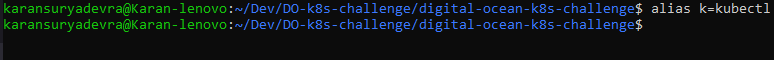
- Once the cluster is created, run the following to ensure you have access to the cluster:
  
  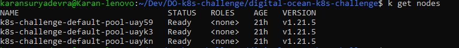


## Step 2: Install the Kubegres Operator
- Now, we can install the Kubegres operator by simply running:
      
  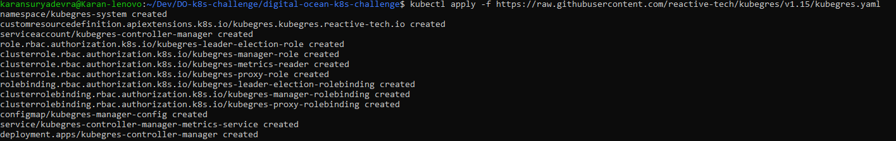
- This creates multiple resources in the 'kubegres-system' namespace. They can be seen by running the following:
  
  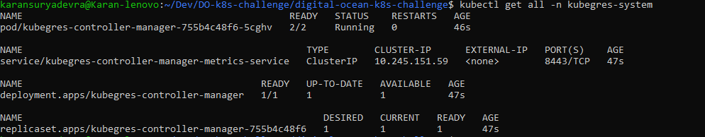
- To see the logs of the controller pod we can run the following command:

  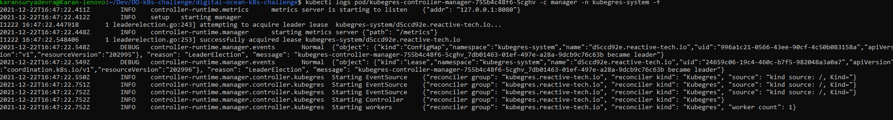


## Step 3: Check for the existence of a Storage Class

- Kubegres requires a storage class in order to create a PV (Persistent Volume) and PVC (Persistent Volume Claim) for each instance of PostgreSQL
- To check for it's existence, we can run the following:

  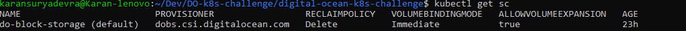
- This shows the default storage class that Digital Ocean provides us after the Kubernetes cluster is spun up


## Step 4: Create a secret

- We need to create a Kubernetes secret resource to store the passwords of the PostgreSQL superuser and replicationuser
- This can be done by creating a postgres-secret.yaml manifest and adding our details to it like this:
  
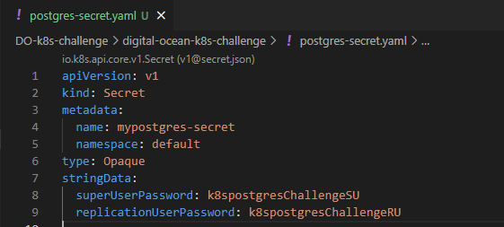
- We can then create the secret by running the following:
  
  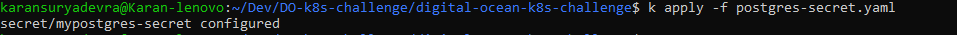
- While this is not the ideal way of creating a secret (since the actual contents of the password are visible as plaintext in the manifest), this is what the official Kubegres documentation recommends
- A better way of doing this would be to use the ```kubectl create secret``` command and its options to create a secret using the command line instead of a manifest

## Step 5: Create PostgreSQL cluster

- We first need to create a manifest that will create a resource of the kind 'Kubegres'
- Here is what my postgres.yaml looked like:
- 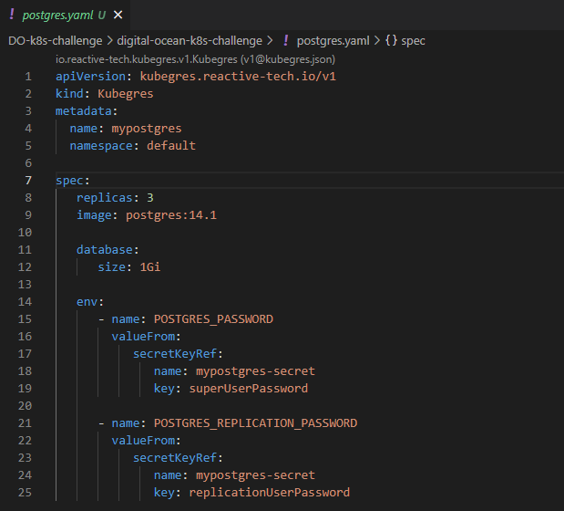

- Next, we apply the manifest:
  
  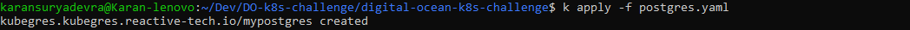
- This should create a PostgreSQL cluster of 3 nodes where 1 pod is the Primary and the other 2 pods are the Replicas
- We can confirm that the resources were created by running:
  
  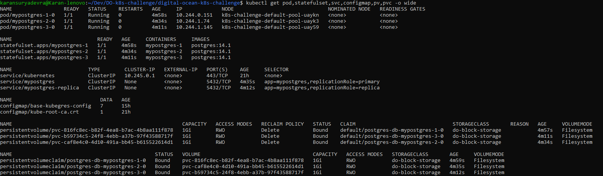
- Here we can see that 3 pods were created each having their own PVC and PV to use

## Step 6: Connect to the cluster

- First we will need to port-forward the postgres service to make it accessible to us so that we can connect to it using psql
- This can be done by running the following:
  
  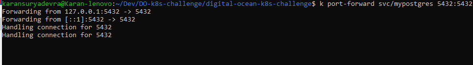
- In another terminal window, we can connect to the cluster and create a table:
  
  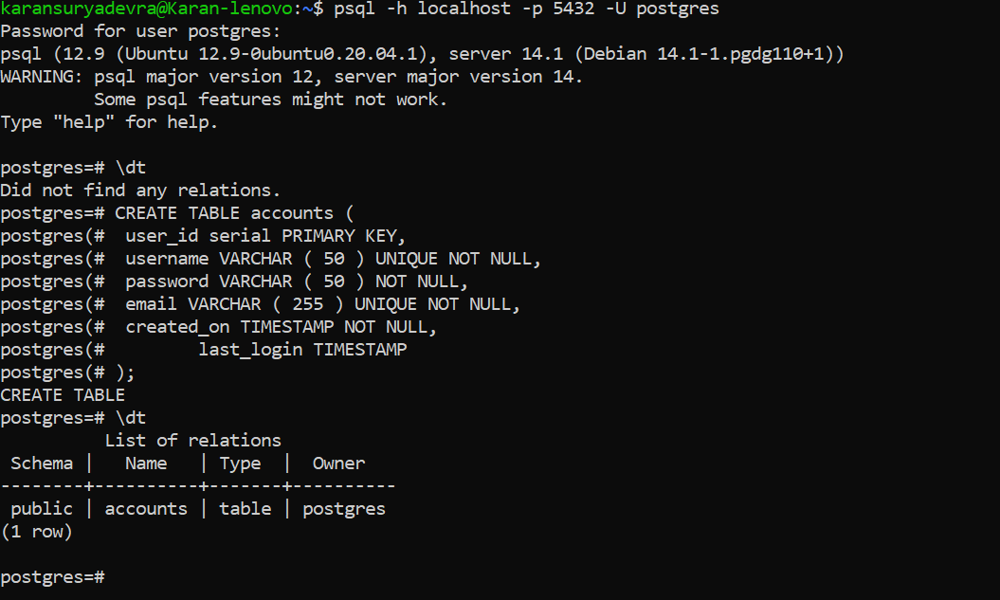
- When prompted for the password, you can use the password that was set for the superuser in the postgres-secret.yaml

## Step 7: Scale the cluster

- Scaling the cluster is simple. Edit the postgres.yaml and set the number of replicas to number you want
- I have set it to 4 here:
- 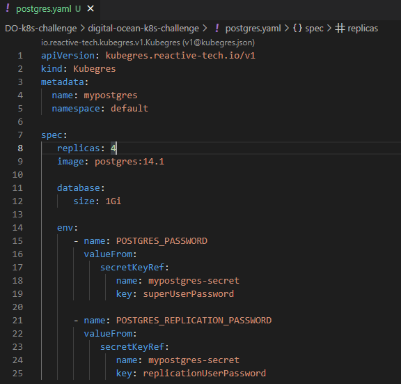
- Then simply apply the yaml:
  
  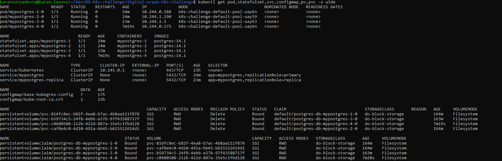
- Here you can see that the number of pods, PVS and PVCs went up by 1 to make the total 4

## Step 8: Test for data redundancy

- To check if the same data is being held in two different pods, we can port-forward the service for the replica pods and test if our table has been created there as well
- Here's how to port-forward:
  
  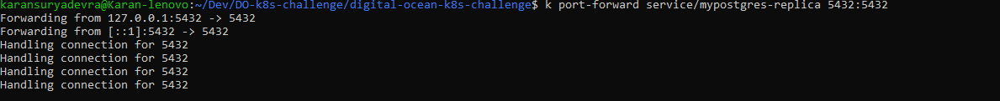
- Here is the test:
  
  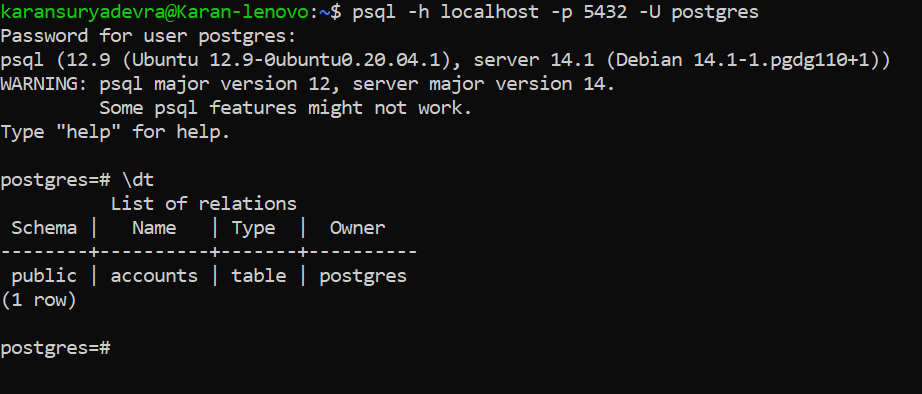

## Conclusion
- We can now use this postgres cluster for various applications and it will be scalable and redundant

## Bonus Step: Cleanup!

- Once you are done using your postgres cluster,it is very simple to delete all of your created resources
- This can be done using the following commands:
  
  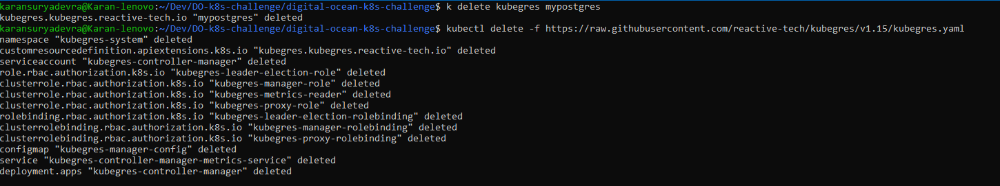


